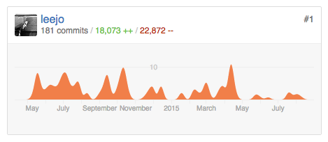

### Adventures in CGI (dot pm)

Lee Johnson

YAPC::EU 2015

---

[leejo.github.io/code](https://leejo.github.io/code)

---

[Messy](https://www.flickr.com/photos/morag_riddell/5544830019/)

---

## AUTOLOAD

---

## CGI::Apache

## CGI::Switch

## CGI::Pretty

## CGI::Fast

---

## Anything marked as deprecated

---

## HTML Generation Functions

---

## About 6000 LOC

(because 1,245 lines of +ve are tests)

---

[Still broken](https://www.flickr.com/photos/alancleaver/3727870484/)

---

## [CCC](https://media.ccc.de/browse/congress/2014/31c3_-_6243_-_en_-_saal_1_-_201412292200_-_the_perl_jam_exploiting_a_20_year-old_vulnerability_-_netanel_rubin.html#video)

---

## [Can't/Won't Fix](https://rt.cpan.org/Public/Dist/Display.html?Status=Rejected;Name=CGI)

---

## It's CGI.pm

---

[Plugin optional](https://www.flickr.com/photos/mrlobo/18172971/)

---
## Legacy Cruft

Get rid of it, or at the least threaten to get rid of it.

That includes RT issues.

---
## Git(hub|lab) / Kiln / BitBucket

[Lazy delegation](https://github.com/leejo/CGI.pm/pulls?q=is%3Apr+is%3Aclosed).

[Travis](https://travis-ci.org): CI.

[Coveralls](https://coveralls.io): Coverage.

---
## Test Coverage

"If all your tests are passing you don't have enough tests."

---
## Vendor Module Management

[https://lists.fedoraproject.org/pipermail/perl-devel/](https://lists.fedoraproject.org/pipermail/perl-devel/)

---
## CGI.pm Was Ubiquitous

It's still all over the place.

---
## But CGI.pm Is "Done"

[Critical bug fixes only.](https://metacpan.org/pod/distribution/CGI/lib/CGI.pod#BUGS)

---
## But CGI.pm Is "Done"

[Critical bug fixes only.](https://metacpan.org/pod/distribution/CGI/lib/CGI.pod#BUGS)

(So don't use it)

---
## Thank you
